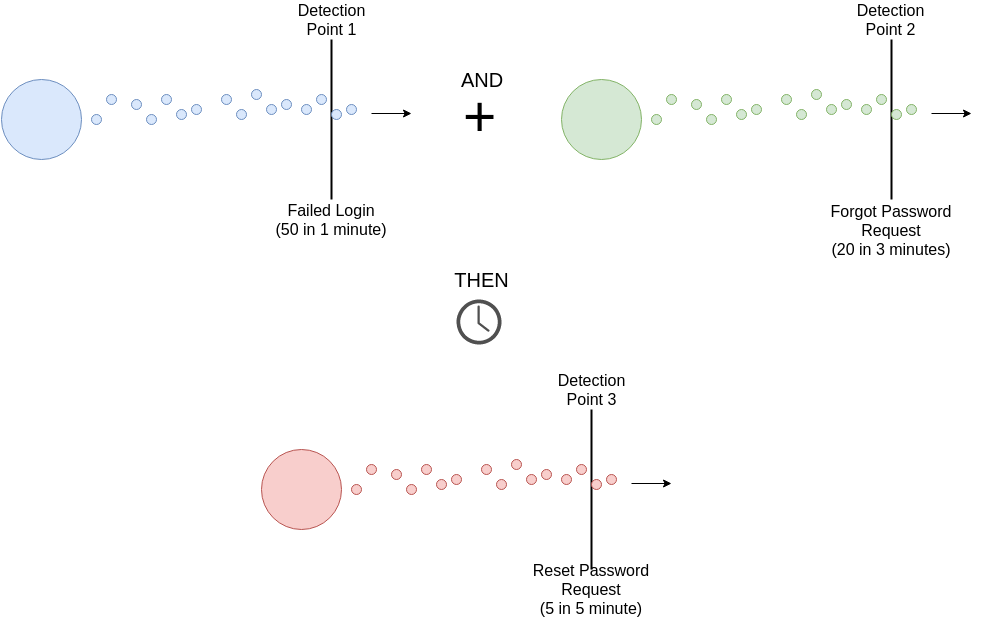

Rules Based Analysis Engines
=========


**Disclaimer**

This component is in beta. Please do not introduce into a production environment without thorough testing. That being said,  we need testers! Please try it out and share your experience with us.

What is it?
------------
The rules based analysis engine is an alternative component to the reference analysis engine. The reference implementation generates an attack when enough events have occured in a short enough period of time to trigger the threshold of a Detection Point.


The rules based implemention, however, combines multiple Detection Points with logical operators. For example, you could make a Rule that generates an Attack when both Detection Point 1 AND Detection Point 2 are triggered. The rules implementation supports boolean operators AND and OR, as well as a temporal operator THEN. This allows for complex combinations such as Detection Point 1 AND Detection Point 2 OR Detection Point 3 Then Detection Point 4.



Why use it?
------------
There are two main goals for the rules engine.

First, to provide greater flexibility. Configurations can now be more expressive, creative, and customized for a specific web application's needs.

Secondly, to improve accuracy. Combining input from multiple Detection Points provides a higher degree of confidence in determining whether activity is definitely malicious, which reduces false positives. The advantage of combining multiple Detection Points can also be used to lower the detection thresholds, without increasing false positives. This allows the rules engine to aggregate multiple "suspicious" activities into a single "malicious" detection.

How does it work?
------------
A Rule has several pieces, with the most basic unit being a Monitor Point. A Monitor Point is essentially the same thing as a Detection Point, except that it cannot trigger Attacks on it's own. Where a configured Detection Point stands alone and will generate an Attack when their Threshold is crossed, a configured Monitor Point can only be a part of a Rule and does not generate an attack when it's Threshold is crossed. Rather only when the proper configuration of Monitor Points in a Rule definition are triggered will the Rule then generate an Attack.


A Rule is made up of one or more Expressions, where an Expression is just a group of Monitor Points along with AND and OR operators. Expressions are separated within a Rule in chronological order by the THEN operators. 
A Rule will generate an Attack only if *each* of it's Expressions evaluate to true. All Expression must be triggered within an interval of time called the Rule's window.

An Expression is made up of one or more Clauses, where a Clause is a a group of monitor points along with AND operators. Clauses are separated within an Expression by the OR operator.
An Expression will evaluate to true and be triggered if *atleast one* of it's Clauses evalutes to true. A Clause must be triggered within an interval of time called the Expression's window.

A Clauses is made up of one or more Monitor Points, where a Monitor Point represents a specific sensor. Monitor Points are separated within a Clause by the AND operator.
A Clause will evaluate to true and be triggered only if *each* of its Monitor Points is triggered.

How do I use it?
------------
1) Include the appsensor-analysis-rules dependency in your pom.xml file like you would the appsensor-analysis-reference dependecy.
```xml
<dependency>
	<groupId>org.owasp.appsensor</groupId>
	<artifactId>appsensor-analysis-rules</artifactId>
	<version>${appsensor.version}</version>
</dependency>
```

2) Add any rule definitions to the appsensor-server-config.xml file. An example of configured rules can be found [here](https://github.com/jtmelton/appsensor/blob/master/analysis-engines/appsensor-analysis-rules/src/test/resources/appsensor-server-config.xml) and the XSD definitions can be found at [here](https://github.com/jtmelton/appsensor/blob/master/appsensor-core/src/main/resources/appsensor_server_config_2.0.xsd).
```xml
<rules>	
<rule guid="00000000-0000-0000-0000-000000000005">
	<name>Rule 2</name>
	<window unit="seconds">10</window>
	<expressions>				
	<expression>
		<window unit="seconds">5</window>
		<clauses>
		<clause>
			<monitor-points>
			<monitor-point guid="00000000-0000-0000-0000-000000000006">
				<category>Input Validation</category>
				<id>IE1</id>
				<threshold>
					<count>1</count>
					<interval unit="seconds">5</interval>
				</threshold>
			</monitor-point>
			</monitor-points>
		</clause>
		</clauses>
	</expression>
	</expressions>
</rule>
</rules>
```

3) Run it! You can see a sample REST configuration with Rules implemented [here](https://github.com/jtmelton/appsensor/tree/master/sample-apps/appsensor-ws-rest-server-with-websocket-boot-rules).

FAQ's
------------
I want to use both the traditional Detection Point model from the reference engine AND the rules model. Can I use both engines in the same configuration?
> Yes! By including both engines in your pom.xml, and configureing both inappsensor-server-config.xml you can leverage both systems.

Do I need to redefine Monitor Points in my appsensor-server-config.xml file if I've already defined them as Detection Points for the reference engine?
> Yes. The Monitor Point server configurations are separate from the Detection Point server configurations.

Do I need to create separate sensors in my web application to generate different events for the Monitor Points, as opposed to Detection Points?
> No, as long as an Event generated by your sensor matches the id and category of the Monitor Point, it will be able to trigger it.

I want to change the order of my logic. How can I write rules such as "sensor 1 and (sensor2 or sensor3)" without the parenthetical precedence operator?
> Distribute it into "sensor 1 and sensor 2 or sensor 1 and sensor 3". We hope build a helper tool that will generate the proper XML configuration from a more natural form like in the question. But for now there is only one level of precedence.
